# my_college_app

My College App Ui Screenshots

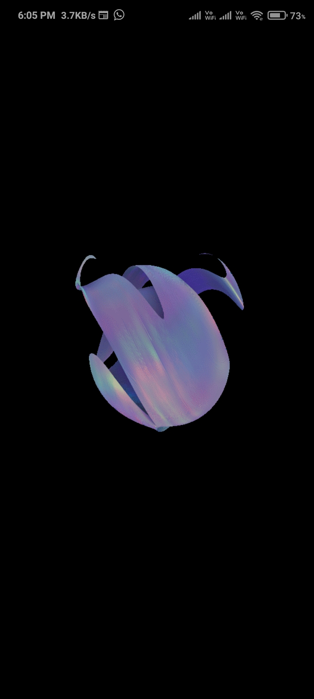

Splash Screen

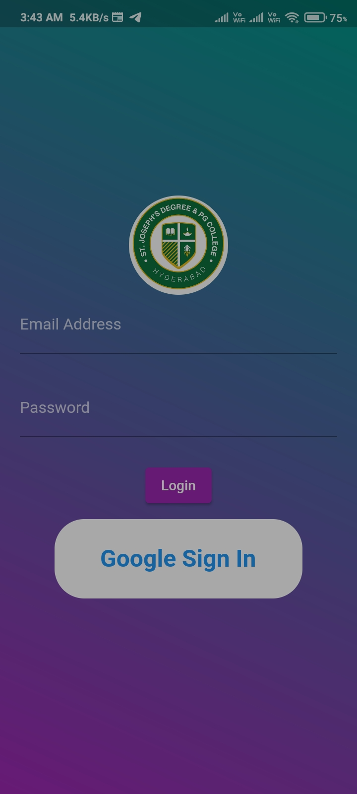

Login Screen

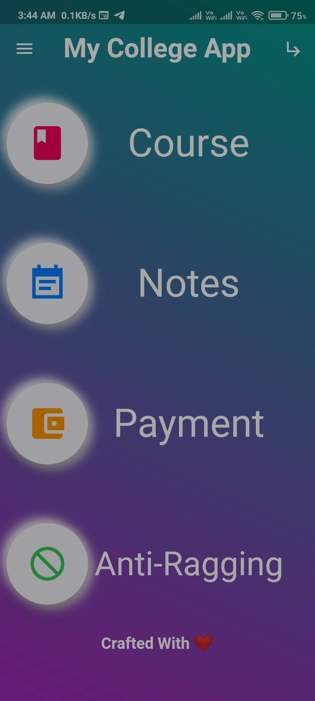

Home Screen Light

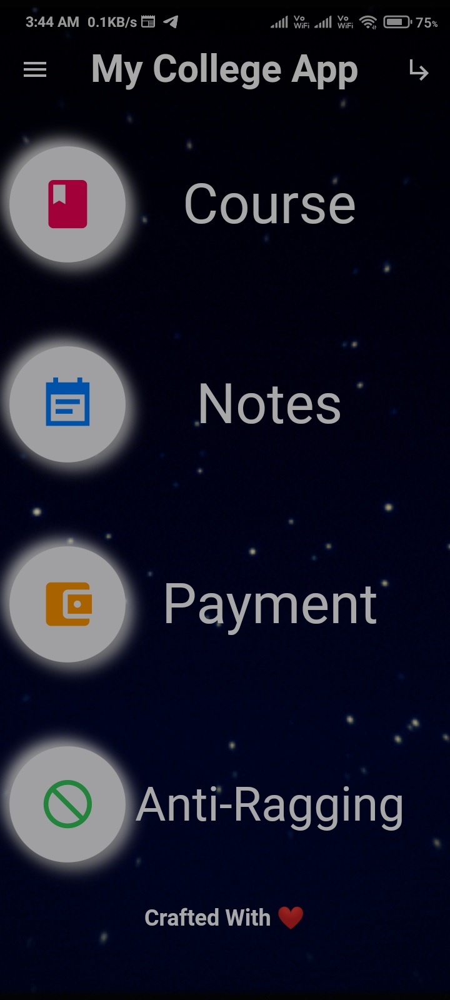

Home Screen Dark

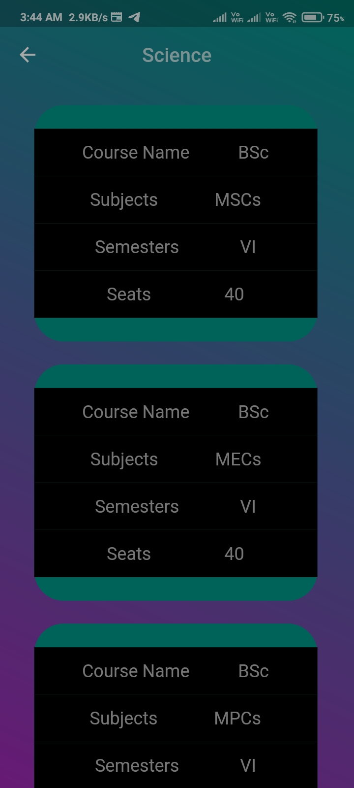

Course Screen light

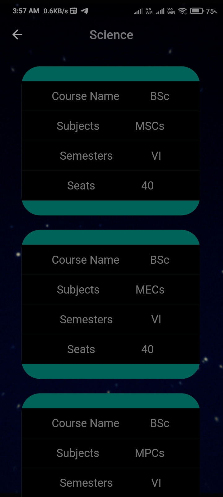

Course Screen Dark

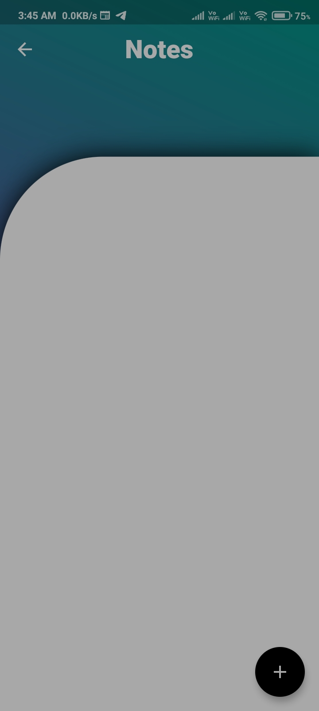

Notes Screen light

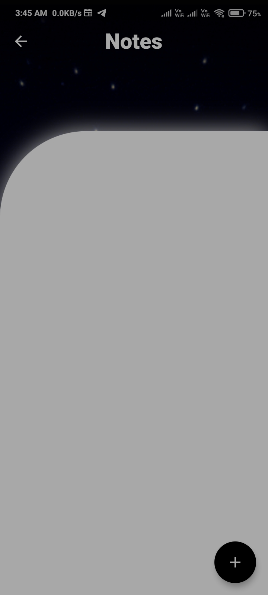

Notes Screen Dark

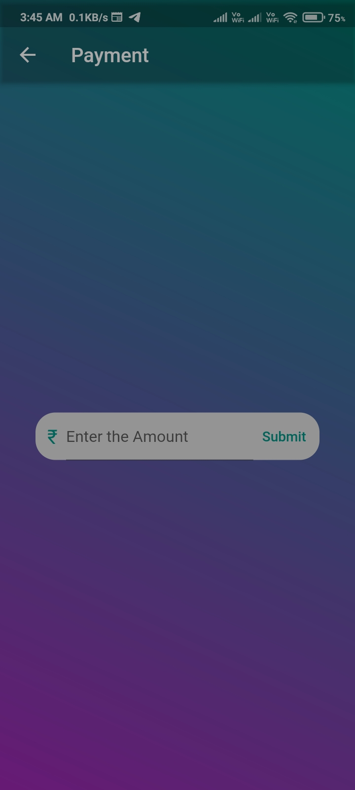

Payment Screen light

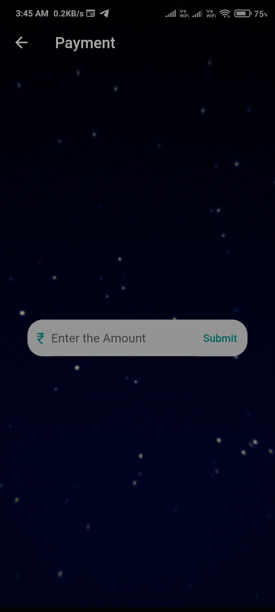

Payment Screen Dark

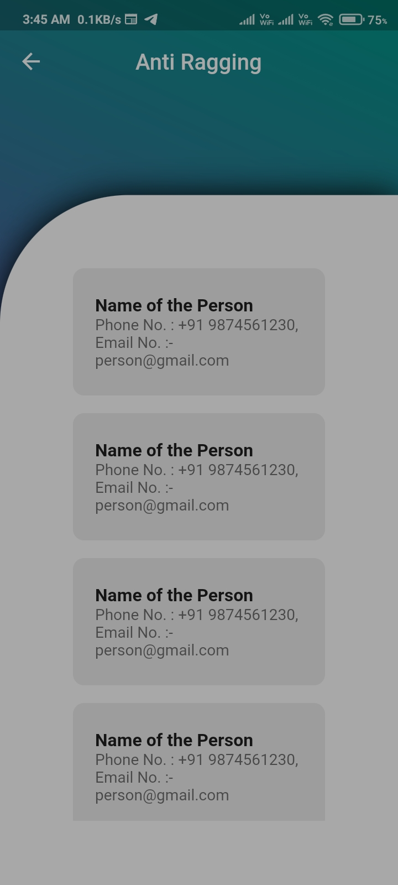

Anti-ragging Screen light

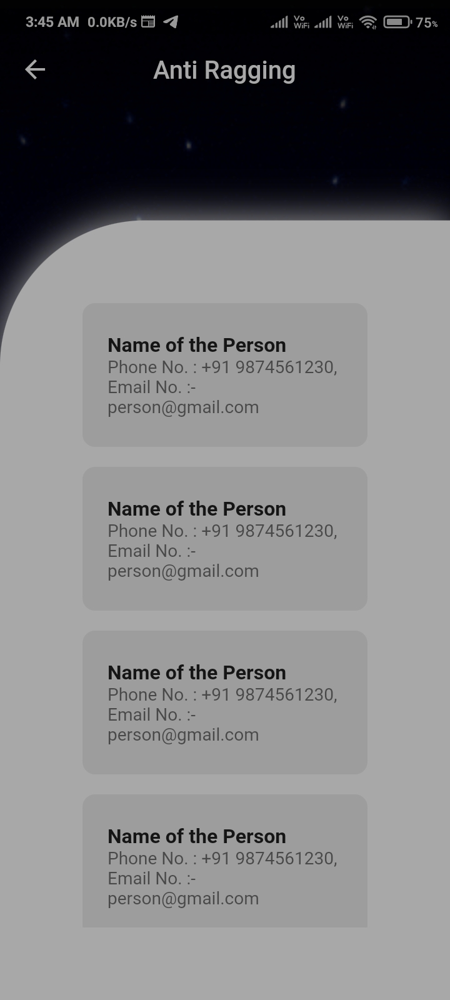

Anti-ragging Screen dark

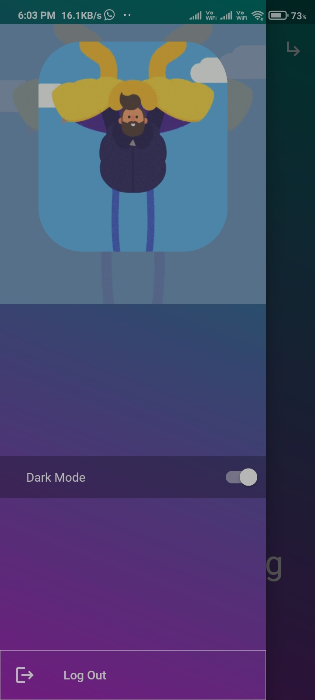

App Drawer Screen light

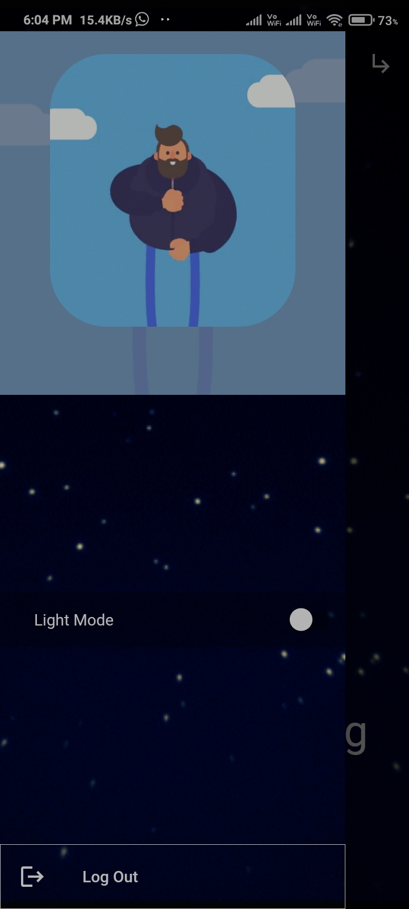

App Drawer Screen dark

Tutorials

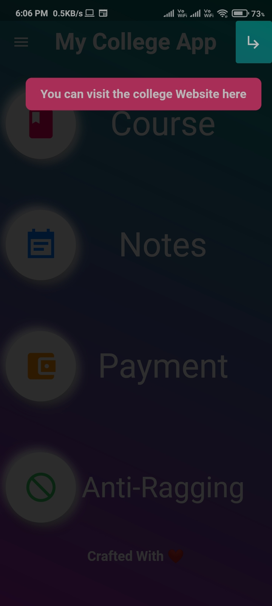 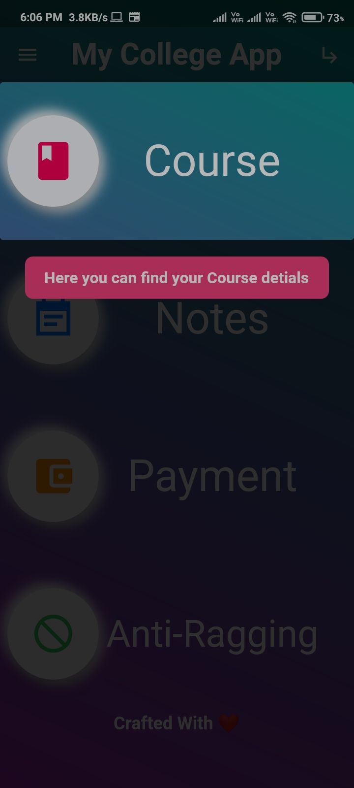 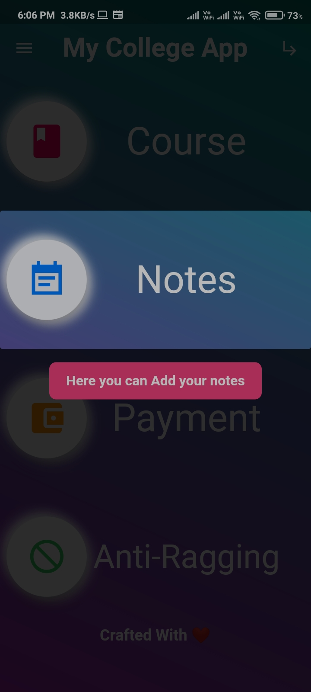 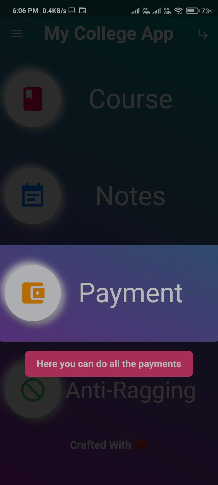 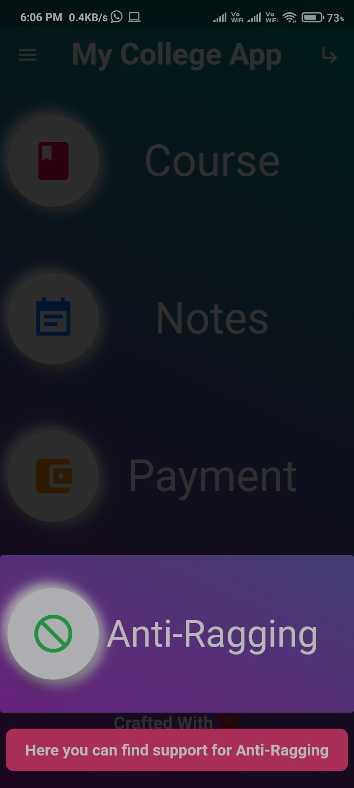

## Getting Started

This project is a starting point for a Flutter application.

A few resources to get you started if this is your first Flutter project:

- [Lab: Write your first Flutter app](https://flutter.dev/docs/get-started/codelab)
- [Cookbook: Useful Flutter samples](https://flutter.dev/docs/cookbook)

For help getting started with Flutter, view our
[online documentation](https://flutter.dev/docs), which offers tutorials,
samples, guidance on mobile development, and a full API reference.
